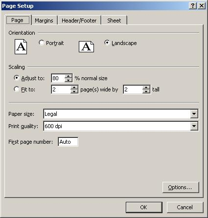

Base SAS: The MSOffice2K\_x Tagset Adds Options to the MSOffice2K Tagset | SAS Support           

The MSOffice2K\_x Tagset Adds Options to the MSOffice2K Tagset
--------------------------------------------------------------

Chevell Parker, SAS Institute

* * *

### Introduction

This section provides example code created with the sample Tagsets.MSOffice2K\_x which modifies the MSOffice2K destination to add options to this new tagset. This code can be run in SAS 9.1.3 or later and opened in Microsoft Excel 97 or greater. Tagsets.MSOffice2K\_x also adds options to perform many of the common tasks in Excel, much like the ODS Excel, and Tagsets.ExcelXP, however, less dynamic and generates the output in the .HTML file format. To use this tagset, save the file msoffice2k\_x.sas to your computer and read [Note 32394: Installing and Storing Updated Tagsets](https://support.sas.com/kb/32/394.html). To see a list of all of the options, use the option DOC="Help".

* * *

### Page Setup

You can modify the values that make up the page setup such as the scaling for printing using the SCALE=. The header and footer values can be modified using the PRINT\_HEADER= and the PRINT\_FOOTER= options. The left, right, top, and bottom margins can be modified using the MARGIN= option. The margins can also be modified using the LEFT\_MARGIN=, RIGHT\_MARGIN=, TOP\_MARGIN=, and BOTTOM\_MARGIN= options. The header and footer margins can be modified using the PRNT\_HEADER\_MARGIN and PRINT\_FOOTER\_MARGIN options, the sheet orientation using the ORIENTATION= option, and the paper size using the PAPERSIZE= option. The FITTOPAGE= option can be used to fit the output to a page. Also the PAGES\_FITHEIGHT= and the PAGES\_FITWIDTH= options can be use to fit the output to a specified number of pages. Other options such as DRAFTQUALITY=, GRIDLINES=, and BLACKANDWHITE= can be used to modify the default print options.

  ods tagsets.msoffice2k\_x file="c:\\temp\\pagestup.xls" style=normal
      options( doc="help"
               scale="85"
               print\_header='&RPage &P Of &N'
               print\_footer="This is a footer"
               margin="1in 2in 3in 4in"
               print\_header\_margin="1in"
               print\_footer\_margin="1in"
               orientation="landscape"
               papersize="legal"
               draftquality="yes"
               gridlines="yes"
               blackandwhite="yes"
               Print\_Fitheight="2"
               Print\_fitwidth="2");

  proc print data=sashelp.class;
  run;

  ods tagsets.msoffice2k\_x close;

* * *

### Worksheet Options

You can use worksheet options such as ZOOM= to change the worksheet zoom, and FITTOPAGE= to change the fittopage setting. The SHEET\_NAME= option can be used to change the sheet name of the worksheet. The TABCOLOR= option can also be specified to add color to the tab. The end of the table contains a blue horizontal rule which can be controlled by specifying the PAGEBREAK= option. Titles and footnotes can be removed by specifying the EMBEDDED\_TITLES=, EMBEDDED\_FOOTNOTES=, and EMBEDDED\_TITLES\_ONCE=.

  ods tagsets.msoffice2k\_x file="c:\\temp\\worksheetoption.xls" style=normal
      options( zoom="70"
               fittopage="yes"
               sheet\_name="New sheet"
               tabcolor="yellow"
               pagebreaks="no"
               embedded\_titles="no"
               embedded\_footnotes="no" );

  proc print data=sashelp.prdsale(obs=50);
  run;

  ods tagsets.msoffice2k\_x close;

* * *

### Display Options

Display options can be added to the output to change the appearance, such as AUTOFILTER= to add filters to the column headers. Headers and row headers can be frozen by using the FROZEN\_HEADER= and the FROZEN\_ROWHEADERS= options. These options allow you specify the ROW or column number to freeze in the output. Images or logos can be added using the IMAGE\_PATH= option to specify the path an name of the image to be displayed. The height and width of the image can be specified using the IMAGE\_HEIGHT= and IMAGE\_WIDTH= options.

  ods tagsets.msoffice2k\_x file="c:\\temp\\display.xls" style=normal
      options( frozen\_headers="3"
               frozen\_rowheaders="1"
               autofilter="yes"
               image\_path="c:\\temp\\tableeditor\_faq\\sas.gif"
               image\_height="85"
               image\_width="75");

  proc print data=sashelp.prdsale(obs=50);
  run;

  ods tagsets.msoffice2k\_x close;

* * *

### Formatting Data

When Excel imports the data created by ODS, it uses the general format to import this data unless there is a specific Excel format applied. There are things that occur that you should be aware of such as leading zeros are dropped. There are other various formatting issues that can occur if the SAS format does not match the Excel format. The Excel format is applied using the Microsoft mso-number-format CSS style property within the HTMLSTYLE= attribute. Specifying the LEADING\_ZERO= option preserves leading zeros on all data values. If a value has a leading zero it is detected and the text format is applied.

data one;
retain zip account;
set sashelp.class;
zip="06555";
account="02345";
run;

ods tagsets.msoffice2k\_x file="c:\\temp\\formatting.xls"
      options( leading\_zero="yes") style=normal;

  proc print data=one;
  Title;
  var zip account;
  var age height / style(data)={htmlstyle="mso-number-format:'##.00'"};
  var weight;
  run;

  ods tagsets.msoffice2k\_x close;

* * *

### Multiple Worksheets per Workbook

The HTML format does not support the multiple worksheets per workbook as the SpreadsheetML format which is created by the ExcelXP destination. The output from the ExcelXP destination embeds the data in the worksheet. To emulate this same behavior using the HTML format, you basically supply a link to an existing file that you want to add to the workbook.

You can add multiple workbooks per worksheet using the WORKSHEET\_SOURCE= option. To specify multiple worksheets per workbook, specify each file separated by commas with this option. To name the worksheet, prefix the file with the sheet name. If no sheet name is given, the sheet name is Table 1, Table 2. This method requires that the sheet name be generated first.

  proc sort data=sashelp.class out=test;
  by age;
  run;

  ods tagsets.msoffice2k path="c:\\temp" file="temp.html" newfile=output;

  proc print data=test;
  by age;
  run;

  ods tagsets.msofice2k close;

  ods tagsets.msoffice2k\_x file="multiple.xls" style=statistical
      options( worksheet\_source="11#c:\\temp\\temp.html,
                                 12#c:\\temp\\temp1.html,
                                 13#c:\\temp\\temp2.html,
                                 14#c:\\temp\\temp3.html,
                                 15#c:\\temp\\temp4.html,
                                 16#c:\\temp\\temp5.html"
               );

  data \_null\_;
    file print;
    put "test";
  run;

  ods tagsets.msoffice2k\_x close;

* * *

### Paneling

You can create simple paneling using the PANCOLS= option, which places tables and graphs side-by-side in the worksheet. You can you also add this with other options to enhance the presentation of the worksheet.

  ods tagsets.msoffice2k\_x  file="c:\\temp\\trash\\test\\panels.xls"
      options(panelcols="3") style=normal;

  proc print data=sashelp.prdsale(obs=10);
  var actual predict country region;
  where country="CANADA";
  title "Canada Sales";
  run;

  proc print data=sashelp.prdsale(obs=10);
  var actual predict country region;
  where country="U.S.A.";
  title "USA Sales";
  run;

  proc print data=sashelp.prdsale(obs=10);
  var actual predict country region;
  where country="GERMANY";
  title "Germany Sales";
  run;

  ods tagsets.msoffice2k\_x  options(panelcols="2") ;

 proc print data=sashelp.prdsale(obs=20);
 where region="EAST";
 title "East Sales";
 run;

 proc print data=sashelp.prdsale(obs=20);
 where region="WEST";
 title "West Sales";
 run;

 ods tagsets.msoffice2k\_x close;

* * *

### Rotated Column Headers

Column headers can be rotated by specifying the ROTATE\_HEADERS= option with the degree you want the header rotated. You should specify this in conjunction with the HEIGHT= option. To specify the header be rotated on a single column, the HTMLSTYLE= option can be specified with the XXXX Microsoft CSS style property.

  ods tagsets.msoffice2k\_x file="c:\\temp\\rotate.xls" style=normal
      options( rotate\_headers="45"
               height="60"  );

  proc print data=sashelp.prdsale;
  title "Rotate header";
  run;

  ods tagsets.msoffice2k\_x close;

* * *

### Page Breaks

Page Breaks can be added the output file by adding the PAGEBREAK\_ROW= option. This option specifies the row(s) that the page break should be added. The arguments for the page break are added and separated by commas to specify multiple rows that the page break should be added.

 ods tagsets.msoffice2k\_x path="c:\\temp\\trash\\test" file="pagebreak.xls"
 options(embedded\_titles="no"
        pagebreak\_row="20,30,40,90");

proc print data=sashelp.orsales;
run;

ods tagsets.msoffice2k\_x close;;

* * *

### Excel Macros

Excel macros can be executed when the file is opened or when the file is closed. This is done by using either the OPEN\_MACRO= or CLOSE\_MACRO= options. These options pass the path of an Excel file that includes the macro that you want to execute.

 ods tagsets.msoffice2k\_x file="c:\\temp\\trash\\mcro.xls" style=normal
     options( open\_macro="'c:\\temp\\macro.xls'!test" );

 proc print data=sashelp.prdsale(obs=10);
 run;

 ods tagsets.msoffice2k\_x close;

* * *

### Excel Style Options

 ods tagsets.msoffice2k\_x file="c:\\temp.xls"
     options(header\_bgcolor="beige"
             header\_fgcolor="brown"
             rowheader\_bgcolor="brown"
             rowheader\_fgcolor="black"
             data\_bgcolor="beige"
             data\_fgcolor="brown"
             banner\_color\_even="pink"
             banner\_color\_odd="yellow"
             fbanner\_color\_even="cyan"
             background\_color="white") ;
 proc print data=sashelp.class ;
 run;

 ods tagsets.msoffice2k\_x close;

